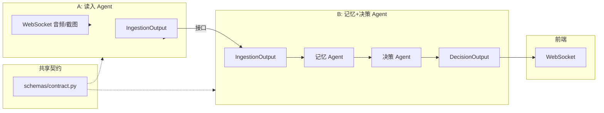

# A/B 协作接口设计

**分工**：

- **A**：读入 Agent（ASR、Vision、情绪推断、发言者匹配）
- **B**：记忆 Agent（存储、摘要）+ 决策 Agent（RAG、建议）

---

## 一、协作架构




---

## 二、共享契约（双方共同维护）

**文件位置**：`backend/schemas/contract.py`

双方均依赖此文件，**不得单方面修改**。变更需协商。

### 2.1 A → B：IngestionOutput（A 产出，B 消费）

```python
from pydantic import BaseModel, Field
from typing import Literal, Optional
from datetime import datetime

class IngestionOutput(BaseModel):
    """读入 Agent 输出，B 的输入。A 负责填充，B 负责消费。"""
    type: Literal["speech", "image"]
    content: str = Field(..., description="转写文本 或 图像描述")
    metadata: dict = Field(default_factory=dict, description="扩展信息")
    timestamp: str = Field(..., description="ISO 8601 时间戳")
    session_id: str = Field(..., description="会议/会话 ID，用于关联同一场会议")
    sequence_id: Optional[int] = Field(None, description="同 session 内顺序号，便于 B 排序")

    class Config:
        json_schema_extra = {
            "example": {
                "type": "speech",
                "content": "我怀疑3号是鸭子，他在锅炉房附近鬼鬼祟祟",
                "metadata": {
                    "speaker_id": "3",
                    "speaker_confidence": 0.92,
                    "emotion_summary": "语气坚定、略带怀疑",
                    "sentence_index": 1,
                    "is_final": True
                },
                "timestamp": "2025-03-18T10:30:00.000Z",
                "session_id": "meeting_abc123",
                "sequence_id": 42
            }
        }
```

**metadata 约定**（A 保证、B 可依赖）：


| 字段                   | 类型    | 说明         | 必填           |
| -------------------- | ----- | ---------- | ------------ |
| `speaker_id`         | str   | 发言者编号/名称   | 发言者匹配开启时有    |
| `speaker_confidence` | float | 发言者检测置信度   | 可选           |
| `emotion_summary`    | str   | 情绪描述       | 情绪推断开启时有     |
| `sentence_index`     | int   | 句子序号       | 可选           |
| `is_final`           | bool  | 是否最终结果     | 可选           |
| `parsed_roles`       | list  | 图像解析出的角色列表 | type=image 时 |
| `voting_status`      | dict  | 投票状态       | type=image 时 |


---

### 2.2 B → 前端：DecisionOutput（B 产出）

```python
class DecisionOutput(BaseModel):
    """决策 Agent 输出，推送给前端。B 负责填充。"""
    session_id: str
    suggestion_type: Literal["speak", "vote", "respond", "general"]
    content: str = Field(..., description="建议文本")
    structured: Optional[dict] = Field(None, description="结构化建议，如投票对象、发言要点")
    timestamp: str
    trigger: Optional[str] = Field(None, description="触发来源：speech/image/summary")

    class Config:
        json_schema_extra = {
            "example": {
                "session_id": "meeting_abc123",
                "suggestion_type": "speak",
                "content": "建议强调你在锅炉房附近见过2号，可转移怀疑目标。",
                "structured": {"key_points": ["锅炉房", "2号"], "tone": "坚定"},
                "timestamp": "2025-03-18T10:30:05.000Z",
                "trigger": "speech"
            }
        }
```

---

### 2.3 会话上下文（B 可选回传给 A）

若 B 需要 A 在后续处理中考虑「当前会议摘要」等上下文，可扩展协议。当前版本**不要求**，A 仅输出 IngestionOutput。

---

## 三、通讯方式

### 方案一：同步调用（推荐，同进程）

同一 FastAPI 进程内，通过 LangGraph 或直接函数调用：

```python
# B 侧：agents/memory.py 或 graph.py
async def ingest_callback(ingestion_output: IngestionOutput):
    """B 提供的回调，A 在产出时调用。"""
    await memory_agent.process(ingestion_output)
    # 可选：触发决策
    decision = await decision_agent.recommend(session_id=ingestion_output.session_id)
    return decision  # 或通过 WebSocket 推送
```

```python
# A 侧：产出时调用
async def on_ingestion_output(output: IngestionOutput):
    await ingest_callback(output)  # 由 B 注入或通过依赖注入
```

**接口约定**：A 接收一个 `callable` 或 `AsyncConsumer[IngestionOutput]`，由 B 在主流程中注入。

---

### 方案二：异步队列（解耦）

使用内存队列或 Redis，A 生产、B 消费：

```python
# 共享：backend/queue/ingestion_queue.py
from asyncio import Queue
ingestion_queue: Queue[IngestionOutput] = Queue(maxsize=1000)

# A 侧：产出时
await ingestion_queue.put(output)

# B 侧：后台消费
async def consume_ingestion():
    while True:
        output = await ingestion_queue.get()
        await memory_agent.process(output)
        # ...
```

**配置**：`config/agent.yaml` 中 `ingestion.delivery: sync | queue`，默认 `sync`。

---

### 方案三：HTTP API（跨服务）

若 A、B 部署为独立服务：

```yaml
# B 暴露的接收端点
POST /api/v1/ingestion
Content-Type: application/json
Body: IngestionOutput (JSON)
```

```python
# A 侧：产出时调用 B 的 HTTP
async def deliver_to_b(output: IngestionOutput):
    await httpx.post(f"{B_SERVICE_URL}/api/v1/ingestion", json=output.model_dump())
```

---

## 四、session_id 约定

- **生成**：由 WebSocket 连接建立时或会议创建时生成，由 `main.py` 或路由层统一管理
- **传递**：A 从 WebSocket 上下文或请求头获取，写入 `IngestionOutput.session_id`
- **B 使用**：按 `session_id` 隔离会议记忆，检索时限定 `session_id`

---

## 五、Mock 与并行开发

### A 的 Mock

B 可提供 Mock 数据，供 A 联调：

```python
# backend/schemas/contract.py 或 fixtures/
MOCK_INGESTION_OUTPUTS = [
    IngestionOutput(
        type="speech",
        content="我怀疑3号是鸭子",
        metadata={"speaker_id": "1", "emotion_summary": "坚定"},
        timestamp="2025-03-18T10:30:00Z",
        session_id="test_session",
        sequence_id=1
    ),
]
```

### B 的 Mock

A 可提供 Mock 消费者，供 B 联调：

```python
# A 侧：Mock 消费者，仅打印
async def mock_ingestion_consumer(output: IngestionOutput):
    print(f"[Mock] Received: {output.model_dump_json()}")
```

---

## 六、目录与职责


| 路径                                              | 负责人    | 说明                                |
| ----------------------------------------------- | ------ | --------------------------------- |
| `backend/schemas/contract.py`                   | **共同** | IngestionOutput、DecisionOutput 契约 |
| `backend/agents/ingestion.py`                   | A      | 读入 Agent，产出 IngestionOutput       |
| `backend/services/asr_service.py`               | A      |                                   |
| `backend/services/vision_service.py`            | A      |                                   |
| `backend/services/emotion_service.py`           | A      |                                   |
| `backend/services/speaker_detection_service.py` | A      |                                   |
| `backend/api/speech.py`                         | A      | WebSocket 语音                      |
| `backend/api/image.py`                          | A      | 截图上传                              |
| `backend/agents/memory.py`                      | B      | 记忆 Agent，消费 IngestionOutput       |
| `backend/agents/decision.py`                    | B      | 决策 Agent                          |
| `backend/services/rag_rules.py`                 | B      | RAG 规则检索                          |
| `backend/agents/graph.py`                       | **共同** | LangGraph 编排，串联 A、B               |
| `backend/main.py`                               | **共同** | 路由、WebSocket 入口、session_id 管理     |


---

## 七、联调检查清单

- 双方拉取最新 `schemas/contract.py`
- A 产出 IngestionOutput 符合 schema，含 `session_id`
- B 能正确解析 `metadata` 中 `speaker_id`、`emotion_summary`
- 同 session 内 `sequence_id` 递增（可选）
- B 的 DecisionOutput 能推送到 WebSocket
- 端到端：语音 → A → B → 前端展示建议

