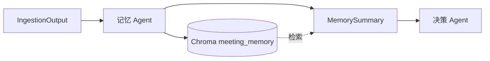

# 记忆 Agent 简易版实现计划

本计划基于 [鹅鸭杀会议分析助手](.cursor/plans/鹅鸭杀会议分析助手_bf791b97.plan.md)、[A/B 协作接口设计](.cursor/plans/AB协作接口设计_.plan.md)、[读入 Agent 实现计划](.cursor/plans/读入_agent_实现计划_121eb861.plan.md)。

**负责人**：B（记忆+决策 Agent）

---

## 一、简易版范围


| 能力                 | 完整版 | 简易版                          |
| ------------------ | --- | ---------------------------- |
| 消费 IngestionOutput | ✓   | ✓                            |
| 结构化存储 Chroma       | ✓   | ✓                            |
| 发言简化（LLM 提炼）       | ✓   | ✗ 暂不做                        |
| 情绪总结（LLM 聚合）       | ✓   | ✗ 直接复用 A 的 emotion_summary   |
| 按 session 隔离       | ✓   | ✓                            |
| 按时间/角色检索           | ✓   | ✓ 按 session_id + metadata 过滤 |
| 输出 MemorySummary   | ✓   | ✓ 简化结构                       |


**核心目标**：存得进、查得出，为决策 Agent 提供可检索的会议上下文。

---

## 二、架构




---

## 三、输入与输出

### 3.1 输入：IngestionOutput（来自 A）

见 [A/B 协作接口设计](.cursor/plans/AB协作接口设计_.plan.md) 2.1 节。关键字段：

- `type`, `content`, `metadata`, `timestamp`, `session_id`, `sequence_id`
- `metadata.speaker_id`, `metadata.emotion_summary` 等

### 3.2 输出：MemorySummary（供决策 Agent）

```python
# backend/schemas/contract.py 中新增
class MemorySummary(BaseModel):
    """记忆 Agent 输出，供决策 Agent 消费。"""
    session_id: str
    summary_text: str = Field(..., description="会议摘要（最近 N 条拼接或 LLM 生成）")
    recent_items: list[dict] = Field(default_factory=list, description="最近几条记录摘要")
    emotion_tags: list[str] = Field(default_factory=list, description="情绪标签列表")
    timestamp: str
```

**简易版实现**：

- `summary_text`：最近 N 条 `content` 直接拼接，格式如 `[speaker_id] content (emotion_summary)`
- `recent_items`：最近 5–10 条 `{speaker_id, content, type, timestamp}` 的简化版
- `emotion_tags`：从 `metadata.emotion_summary` 提取关键词，或简单去重列表

---

## 四、存储设计

### 4.1 Chroma 集合

- **集合名**：`meeting_memory`（与规则库 `goose_goose_duck` 分离）
- **持久化**：`chroma_db` 目录下，可配置 `meeting_memory_persist_path`

### 4.2 Document 结构

每条 IngestionOutput 转为 1 个 Document：

```python
# page_content：用于向量检索的文本
page_content = f"[{speaker_id}] {content}"  # 含发言者便于检索

# metadata：用于过滤与展示
metadata = {
    "session_id": output.session_id,
    "type": output.type,
    "speaker_id": output.metadata.get("speaker_id", ""),
    "emotion_summary": output.metadata.get("emotion_summary", ""),
    "timestamp": output.timestamp,
    "sequence_id": output.sequence_id or 0,
}
```

### 4.3 配置（config/chroma.yaml 或 config/agent.yaml）

```yaml
meeting_memory:
  collection_name: meeting_memory
  persist_directory: chroma_db
  k: 5                    # 检索时返回条数
```

---

## 五、核心接口

### 5.1 MemoryAgent 类

```python
# backend/agents/memory.py

class MemoryAgent:
    def __init__(self):
        self.vec_store = MeetingMemoryStore()  # 封装 Chroma meeting_memory

    async def process(self, output: IngestionOutput) -> MemorySummary:
        """消费一条 IngestionOutput：存储 + 返回当前摘要。"""
        self._store(output)
        return self._build_summary(output.session_id)

    def _store(self, output: IngestionOutput) -> None:
        """将 IngestionOutput 转为 Document 存入 Chroma。"""
        ...

    def _build_summary(self, session_id: str, recent_n: int = 10) -> MemorySummary:
        """构建 MemorySummary：检索最近 N 条 + 拼接 summary_text。"""
        ...
```

### 5.2 MeetingMemoryStore 服务

```python
# backend/services/meeting_memory_store.py

class MeetingMemoryStore:
    """会议记忆向量存储，复用现有 Chroma + Embedding。"""
    
    def add(self, doc: Document) -> None:
        """单条写入。"""
        
    def get_recent(self, session_id: str, k: int = 10) -> list[Document]:
        """按 session_id 获取最近 k 条。需 metadata 过滤或按 sequence_id 排序。"""
        
    def search(self, session_id: str, query: str, k: int = 5) -> list[Document]:
        """语义检索，限定 session_id。"""
```

**注意**：Chroma 默认按插入顺序，`get_recent` 可通过 `sequence_id` 或 `timestamp` 在应用层排序；若 Chroma 支持 metadata 过滤，可 `where={"session_id": session_id}` 后取最新。

---

## 六、与决策 Agent 的衔接

- 决策 Agent 调用 `memory_agent.get_summary(session_id)` 或 `memory_agent.process(output)` 的返回值
- 简易版：`MemorySummary.summary_text` 作为 RAG 之外的「会议上下文」拼入决策 Agent 的 prompt

---

## 七、目录与文件


| 路径                                         | 说明                       |
| ------------------------------------------ | ------------------------ |
| `backend/agents/memory.py`                 | MemoryAgent 主逻辑          |
| `backend/services/meeting_memory_store.py` | Chroma meeting_memory 封装 |
| `backend/schemas/contract.py`              | 新增 MemorySummary         |


---

## 八、实施步骤

1. 在 `config/chroma.yaml` 或 `config/agent.yaml` 中增加 `meeting_memory` 配置
2. 实现 `MeetingMemoryStore`：初始化 Chroma 集合、`add`、`get_recent`、`search`
3. 在 `contract.py` 中新增 `MemorySummary`
4. 实现 `MemoryAgent.process`：`_store` + `_build_summary`
5. 单测：Mock IngestionOutput → process → 验证 Chroma 中有记录、MemorySummary 结构正确
6. 与 A 联调：确保 A 的 consumer 调用 `memory_agent.process(output)`

---

## 九、依赖

- 复用现有：`langchain_chroma`, `model.factory.embedding_model`, `utils.config_handler`
- 无新增依赖

---

## 十、后续扩展（非简易版）

- 发言简化：LLM 对 `content` 做提炼后再存储
- 情绪总结：LLM 对多条 `emotion_summary` 做聚合
- 摘要生成：每 N 条触发一次 LLM 生成 `summary_text`，替代简单拼接

