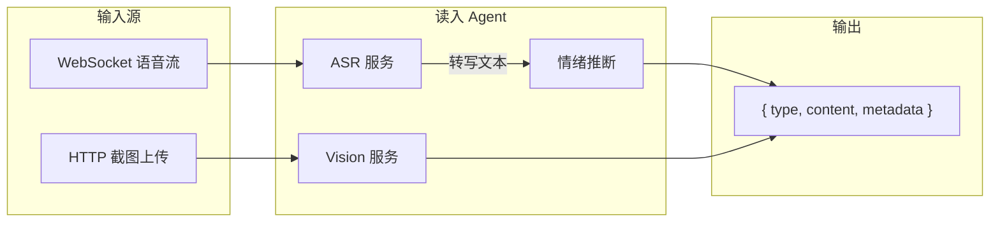
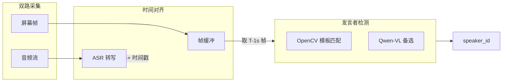

# 读入 Agent（Ingestion Agent）实现计划

本计划为 [鹅鸭杀会议分析助手](.cursor/plans/鹅鸭杀会议分析助手_bf791b97.plan.md) 中读入 Agent 的详细实现方案。

## 一、架构概览




**数据流**：

- **语音**：WebSocket 音频帧 → Fun-ASR 流式转写 → 句子结束触发 LLM 情绪推断 → 输出
- **图像**：HTTP 上传 Base64/文件 → Qwen-VL 解析 → 输出
- **发言者匹配**：屏幕帧缓冲 + 发言者检测 → 与 ASR 结果时间对齐 → 输出 `metadata.speaker_id`

---

## 二、发言者与语音匹配（核心补充）

### 问题

- 不知道玩家何时结束发言
- 发言人不会说「现在是 X 号发言」
- 需要简单、快速的方式将发言者与语音对应

### 思路：视觉发言标识 + 时间对齐

鹅鸭杀会议界面中，**正在发言的玩家卡牌通常有视觉标识**（麦克风图标、高亮边框、波形、不同颜色等）。通过持续捕获屏幕，在 ASR 返回转写结果时，用「发言开始时刻」对应的屏幕帧检测当前发言者，即可实现匹配。




### 方案对比：OpenCV vs Vision


| 方案               | 速度     | 准确度      | 适用场景                | 实现难度        |
| ---------------- | ------ | -------- | ------------------- | ----------- |
| **OpenCV 模板匹配**  | 快（毫秒级） | 高（若模板一致） | 发言标识固定（如麦克风图标、高亮边框） | 需预先截取模板图    |
| **OpenCV 颜色/区域** | 快      | 中        | 发言时卡牌有固定颜色变化        | 需定义 ROI 与阈值 |
| **Qwen-VL**      | 慢（秒级）  | 高、泛化好    | 标识不固定、UI 多变         | 直接调用，无需模板   |


**推荐策略**：优先 OpenCV，备选 Vision

- 鹅鸭杀发言卡牌有固定标识（麦克风、边框等）时，OpenCV 模板匹配即可，**快速且轻量**
- 若 UI 更新或标识不统一，可切换为 Qwen-VL 或做 OpenCV + Vision 混合

### 时间同步策略

- ASR 有延迟：转写结果通常在发言结束后 0.5–1.5 秒返回
- 策略：**用「发言开始前约 1 秒」的屏幕帧** 做发言者检测
- 实现：维护带时间戳的屏幕帧缓冲（如最近 5–10 秒，1–2 FPS），ASR 返回时取 `now - 1s` 对应的帧

### 实现要点

1. **双路采集**：开发脚本同时采集系统音频 + 屏幕，通过 WebSocket 发送（或复用现有音频 WebSocket，扩展协议支持「音频 + 屏幕」）
2. **帧缓冲**：后端维护 `(timestamp, frame)` 队列，保留最近 N 秒
3. **发言者检测服务**：`services/speaker_detection_service.py`
  - OpenCV：在预定义玩家卡牌 ROI 上做模板匹配，检测哪个区域有「发言中」标识
  - 或调用 Qwen-VL：`请指出图中当前正在发言的玩家编号/名称`
4. **配置**：`speaker_detection.method: opencv | vision`，`opencv.template_path`、`opencv.roi_regions` 等

### OpenCV 模板匹配流程

1. 从游戏截图中截取「发言中」标识（麦克风、高亮边框等）作为模板
2. 定义各玩家卡牌的 ROI 区域（坐标或相对比例）
3. 对每个 ROI 做 `cv.matchTemplate`，阈值以上即判定为该玩家在发言
4. 若多区域同时匹配，取置信度最高者

### 模板与 ROI 获取步骤（实操）

1. **播放会议视频**，在有人发言时暂停
2. **截图**，用画图/截图工具从发言者卡牌上截取「发言标识」小图（如麦克风图标、高亮边框），保存为 `assets/templates/speaking_indicator.png`
3. **确定 ROI**：用同一张截图，量取各玩家卡牌的大致区域 `[x, y, w, h]`；若分辨率固定，可写死；否则用相对比例（如 `x = width * 0.1`）
4. **首次运行**：可先用 `method: vision` 验证效果，再切换到 OpenCV 做性能优化

---

## 三、输出格式规范

与 B 的协作契约见 [A/B 协作接口设计](.cursor/plans/AB协作接口设计_plan.md)。此处为概要。

```python
# 统一输出结构（Pydantic）- 定义于 backend/schemas/contract.py
class IngestionOutput(BaseModel):
    type: Literal["speech", "image"]
    content: str
    metadata: dict
    timestamp: str                 # ISO 8601
    session_id: str               # 会议 ID，由路由层传入
    sequence_id: Optional[int]    # 同 session 内顺序号

# speech 示例（含发言者匹配）
{
    "type": "speech",
    "content": "我怀疑3号是鸭子，他在锅炉房附近鬼鬼祟祟",
    "metadata": {
        "speaker_id": "3",
        "speaker_confidence": 0.92,
        "emotion_summary": "语气坚定、略带怀疑，语速较快",
        "sentence_index": 1,
        "is_final": True
    },
    "timestamp": "2025-03-18T10:30:00.000Z",
    "session_id": "meeting_abc123",
    "sequence_id": 42
}

# image 示例
{
    "type": "image",
    "content": "会议界面显示：当前发言顺序为玩家2、3、5；投票界面，5号被投出3票；玩家列表显示存活角色：1鹅、2鸭、3鹅...",
    "metadata": {
        "parsed_roles": ["玩家2", "玩家3", "玩家5"],
        "voting_status": {"5号": 3},
        "image_size": [1920, 1080]
    },
    "timestamp": "2025-03-18T10:30:05.000Z"
}
```

---

## 四、目录与文件结构

```
backend/
├── main.py                    # FastAPI 入口、WebSocket 路由
├── api/
│   ├── __init__.py
│   ├── speech.py              # WebSocket 语音端点
│   └── image.py               # HTTP 截图上传端点
├── agents/
│   ├── __init__.py
│   └── ingestion.py           # 读入 Agent 编排
├── services/
│   ├── __init__.py
│   ├── asr_service.py         # 阿里云 Fun-ASR 封装
│   ├── vision_service.py      # 通义 Qwen-VL 封装
│   ├── emotion_service.py     # 基于 LLM 的情绪推断（支持可调粒度）
│   └── speaker_detection_service.py  # OpenCV/Vision 发言者检测
├── schemas/
│   ├── __init__.py
│   └── ingestion.py           # IngestionOutput 等
└── config/
    └── ingestion.yaml         # ASR/Vision/Emotion 模型与粒度参数

scripts/
├── audio_capture_dev.py       # 开发期：PyAudioWPatch 捕获系统音频 → WebSocket
└── dual_capture_dev.py       # 开发期：音频 + 屏幕双路采集 → WebSocket（支持发言者匹配）

assets/                        # 可选：OpenCV 模板资源
└── templates/                 # 发言标识模板图（从游戏截取）
    └── speaking_indicator.png
```

---

## 五、核心模块实现要点

### 4.1 ASR 服务（`services/asr_service.py`）

**技术选型**：阿里云 DashScope `dashscope.audio.asr.Recognition`

**要点**：

- 使用 **双向流式**：`recognition.start()` → `send_audio_frame(data)` → `on_event` 回调
- 音频格式：PCM 16kHz 单声道（与前端约定）；每帧约 100ms，建议 3200 bytes
- 回调中收集 `sentence['text']`，当 `RecognitionResult.is_sentence_end(sentence)` 时视为完整句子，触发回调给上层
- 需在 **独立线程/异步** 中运行，避免阻塞 WebSocket 事件循环

**依赖**：`dashscope`（需 `pip install dashscope`）

**配置**：`config/ingestion.yaml` 或 `config/agent.yaml` 中增加：

```yaml
asr:
  model: fun-asr-realtime
  format: pcm
  sample_rate: 16000
  chunk_size: 3200
```

---

### 4.2 Vision 服务（`services/vision_service.py`）

**技术选型**：通义 Qwen-VL，通过 OpenAI 兼容 API 调用

**要点**：

- 使用 `openai` 库，`base_url="https://dashscope.aliyuncs.com/compatible-mode/v1"`
- 图像输入：`image_url` 支持 `data:image/jpeg;base64,{b64}` 或 URL
- 提示词：设计专用 prompt 引导模型提取会议画面信息，例如：
  - 发言顺序、当前发言者
  - 投票界面（谁被投、票数）
  - 角色列表、存活状态
  - 地图/场景信息（若有）

**依赖**：`openai`（或 `dashscope` 若其支持 VL）

**配置**：

```yaml
vision:
  model: qwen-vl-plus
  base_url: https://dashscope.aliyuncs.com/compatible-mode/v1
```

---

### 4.3 情绪推断服务（`services/emotion_service.py`）

**背景**：阿里云 ASR 不提供语气/情绪输出，需基于文本推断。

**方案**：使用现有 LLM（通义 qwen3-max）对转写文本做轻量情绪描述。

**要点**：

- 输入：单句或聚合文本（由 `granularity` 决定，见第九节）
- 输出：简短描述，如「语气坚定、略带怀疑」「语速较快、情绪激动」
- 设计 prompt 模板，限制输出长度（`max_summary_length` 可配置）
- 可异步调用，不阻塞 ASR 流
- 粒度可调：`per_sentence` / `per_segment` / `per_time_window` / `disabled`

**Prompt 示例**（存入 `prompts/ingestion_emotion.txt`）：

```
根据以下鹅鸭杀会议发言内容，用一句话（50字以内）描述说话者的语气、语调或情绪倾向。
只输出描述，不要解释。
发言：{text}
```

---

### 4.4 读入 Agent 编排（`agents/ingestion.py`）

**职责**：协调 ASR、Vision、Emotion，输出统一格式。

**接口设计**：

```python
class IngestionAgent:
    def __init__(self, session_id: str, consumer: Callable[[IngestionOutput], Awaitable[None]] | None = None):
        # consumer：B 注入的 async 回调，A 产出 IngestionOutput 时调用；若 None 则仅 yield
    
    async def process_speech(self, audio_frame: bytes, ...) -> AsyncGenerator[IngestionOutput, None]
        # 产出 IngestionOutput 时：yield 并 await consumer(output)
    
    def push_screen_frame(self, frame: bytes, ts: float) -> None
        # 供 WebSocket 在双路模式下调用
    
    async def process_image(self, image_data: bytes | str) -> IngestionOutput
        # 产出后调用 consumer(output)
```

**语音流处理**：

- 需维护 ASR `Recognition` 实例与 WebSocket 连接的生命周期
- 建议：每个 WebSocket 连接对应一个 ASR 会话，连接断开时 `recognition.stop()`
- 句子级输出：仅在 `is_sentence_end` 时 yield，避免半句频繁推送

**发言者匹配**（当 `speaker_detection.method != disabled`）：

- 维护屏幕帧缓冲 `[(ts, frame), ...]`
- ASR 返回句子时，取 `now - lookback_seconds` 对应的帧，调用 `speaker_detection_service.detect(frame)`，将结果写入 `metadata.speaker_id`

---

### 4.5 发言者检测服务（`services/speaker_detection_service.py`）

**职责**：从会议界面截图中识别当前发言者。

**OpenCV 模式**（推荐，快速）：

- 输入：截图（numpy array 或 bytes）
- 配置：`roi_regions`（各玩家卡牌区域）、`template_path`（发言标识模板）
- 流程：对各 ROI 做 `cv.matchTemplate`，返回置信度最高的玩家编号
- 依赖：`opencv-python`

**Vision 模式**（备选，泛化好）：

- 调用 Qwen-VL，prompt：`这是鹅鸭杀会议界面，请指出当前正在发言的玩家编号（有麦克风/高亮等标识）。仅输出数字。`
- 适用于 UI 变化或无法预先截取模板时

**配置**（`config/ingestion.yaml`）：

```yaml
speaker_detection:
  method: opencv              # opencv | vision | disabled
  opencv:
    template_path: assets/templates/speaking_indicator.png
    roi_regions:               # 各玩家卡牌 [x, y, w, h]，可按分辨率比例
      - [100, 200, 80, 120]    # 玩家1
      - [200, 200, 80, 120]    # 玩家2
      # ...
    match_threshold: 0.7
  lookback_seconds: 1.0        # ASR 结果对应帧的时间回溯
```

---

### 4.6 API 层

**WebSocket 语音**（`api/speech.py`）：

- 路径：`/ws/speech` 或 `/api/v1/ws/speech`
- **模式一（仅音频）**：客户端发送二进制音频帧（PCM 16kHz 16bit），服务端推送 `IngestionOutput`（无 `speaker_id`）
- **模式二（音频+屏幕）**：客户端发送 JSON `{ "audio": base64, "screen": base64, "ts": unix_ms }` 或分通道（如 `channel=0` 音频、`channel=1` 屏幕），服务端缓冲屏幕帧，ASR 返回时做发言者检测，输出含 `speaker_id`

**HTTP 截图**（`api/image.py`）：

- 路径：`POST /api/v1/ingestion/image`
- 请求：`multipart/form-data` 文件或 `application/json` 中的 Base64
- 响应：`IngestionOutput` JSON

---

## 六、依赖清单

在 `requirements.txt` 中新增：

```
fastapi>=0.109.0
uvicorn[standard]>=0.27.0
websockets>=12.0
dashscope>=1.14.0          # 阿里云 ASR
openai>=1.0.0              # 调用 Qwen-VL 兼容 API
python-multipart>=0.0.6
opencv-python>=4.8.0       # 发言者检测（OpenCV 模板匹配）
```

**开发期采集**（可选）：

```
PyAudioWPatch>=0.2.14      # Windows WASAPI Loopback，捕获系统音频
mss>=9.0.0                 # 双路采集：跨平台屏幕截图
```

---

## 七、配置与 Prompt


| 文件                              | 内容                                                                                                |
| ------------------------------- | ------------------------------------------------------------------------------------------------- |
| `config/agent.yaml`             | 扩展 `ingestion` 节点：asr、vision、emotion、speaker_detection 参数                                         |
| `config/prompts.yaml`           | 增加 `ingestion_emotion_prompt_path`、`ingestion_vision_prompt_path`、`ingestion_speaker_prompt_path` |
| `prompts/ingestion_emotion.txt` | 情绪推断 prompt                                                                                       |
| `prompts/ingestion_vision.txt`  | 会议截图解析 prompt                                                                                     |
| `prompts/ingestion_speaker.txt` | 发言者检测 prompt（Vision 模式用）                                                                          |


---

## 八、实施步骤（建议顺序）

1. **搭建 FastAPI 骨架**：`main.py`、路由、CORS、基础 WebSocket 占位
2. **实现 ASR 服务**：封装 `Recognition` 流式调用，支持回调/异步
3. **实现 Vision 服务**：Qwen-VL 调用，设计会议截图解析 prompt
4. **实现情绪服务**：LLM 情绪推断，加载 prompt，支持可配置粒度（第十节）
5. **实现 Ingestion Agent**：编排 process_speech、process_image，集成粒度配置
6. **实现 WebSocket 语音 API**：接收音频 → 转发 ASR → 回推 IngestionOutput
7. **实现 HTTP 截图 API**：接收上传 → 调用 Vision → 返回 IngestionOutput
8. **开发期音频采集脚本**：`scripts/audio_capture_dev.py`，PyAudioWPatch 捕获系统音频并发送至 WebSocket
9. **发言者检测服务**：`speaker_detection_service.py`，OpenCV 模板匹配 + Vision 备选
10. **双路采集脚本**：`scripts/dual_capture_dev.py`，音频 + 屏幕同时采集并发送，支持发言者匹配联调
11. **单测与联调**：各服务独立测试，端到端验证（含发言者匹配）

---

## 九、开发期音频采集方案（本地播放视频模拟）

开发时通过本地播放鹅鸭杀视频模拟游戏过程，需从系统/桌面捕获正在播放的音频。可选方案如下：

### 方案 A：Python 开发脚本 + PyAudioWPatch（推荐用于后端联调）

- **原理**：使用 `PyAudioWPatch` 的 WASAPI Loopback 模式，直接捕获 Windows 系统扬声器输出
- **实现**：独立脚本 `scripts/audio_capture_dev.py`，读取系统音频 → 重采样为 16kHz 单声道（若需）→ 通过 WebSocket 发送到后端
- **优点**：无需改前端、无需虚拟设备，纯 Python 即可；与后端 WebSocket 协议一致
- **依赖**：`pip install PyAudioWPatch`
- **注意**：仅 Windows；需以默认扬声器为输出设备

```python
# 伪代码：scripts/audio_capture_dev.py
import pyaudiowpatch as pyaudio
# 获取 WASAPI 环回设备 → open stream → read chunks → 发送到 ws://localhost:8000/ws/speech
```

### 方案 B：虚拟声卡 + 浏览器麦克风

- **原理**：安装 VB-Audio Cable / VoiceMeeter 等，将系统输出路由到「虚拟麦克风」；前端 `getUserMedia` 从该麦克风采集，经 `MediaRecorder` 或 `ScriptProcessorNode` 发送
- **优点**：复用前端既有麦克风采集逻辑，与生产环境一致
- **缺点**：需用户手动安装、配置虚拟声卡

### 方案 C：屏幕共享 + getDisplayMedia

- **原理**：在浏览器中播放视频（或共享播放视频的窗口），使用 `getDisplayMedia({ video: true, audio: true })` 捕获含音频的 MediaStream
- **优点**：无需安装额外软件，纯前端
- **缺点**：需在浏览器内播放视频；部分浏览器对系统音频捕获支持有限

### 推荐组合

- **开发阶段**：优先使用 **方案 A**，快速验证 ASR + 读入 Agent 全链路
- **前端开发**：同时保留麦克风采集路径，生产环境用麦克风，开发时可切换为方案 B 或 C

---

## 十、情绪推断粒度（可调节）

通过配置文件调节情绪推断的触发粒度，支持多种模式：

### 配置项（`config/agent.yaml` 或 `config/ingestion.yaml`）

```yaml
emotion:
  granularity: per_sentence    # 可选: per_sentence | per_segment | per_time_window | disabled
  segment_size: 3             # granularity=per_segment 时，每 N 句聚合后推断
  time_window_seconds: 30     # granularity=per_time_window 时，每 N 秒聚合
  max_summary_length: 80      # 情绪描述最大字数
```

### 粒度模式说明


| 模式                | 说明                                    | 适用场景             |
| ----------------- | ------------------------------------- | ---------------- |
| `per_sentence`    | 每句 ASR 转写结束后立即推断                      | 细粒度，实时反馈         |
| `per_segment`     | 每累积 N 句（`segment_size`）后聚合推断          | 减少 LLM 调用，适合密集发言 |
| `per_time_window` | 每 N 秒内的发言聚合后推断                        | 按时间窗口汇总情绪        |
| `disabled`        | 不进行情绪推断，`metadata.emotion_summary` 为空 | 节省成本或仅需转写        |


### 实现要点

- `emotion_service.py` 接收配置，根据 `granularity` 决定调用时机
- `ingestion.py` 维护缓冲区：句子队列 / 时间窗口，满足条件时调用 `emotion_service.infer(text_batch)`
- 当 `granularity=disabled` 时，跳过 LLM 调用，直接输出转写内容

---

## 十一、待确认事项（已澄清）

- ~~**前端音频格式**~~：统一采用 PCM 16kHz 16bit 单声道；开发期可用方案 A 脚本直接发送。
- ~~**情绪推断粒度**~~：可调节，见第十节配置。
- **WebSocket 与 ASR 的线程模型**：ASR 的 `Recognition` 在同步回调中运行，需用 `asyncio.to_thread` 或 `run_in_executor` 避免阻塞事件循环，具体实现时再细化。

