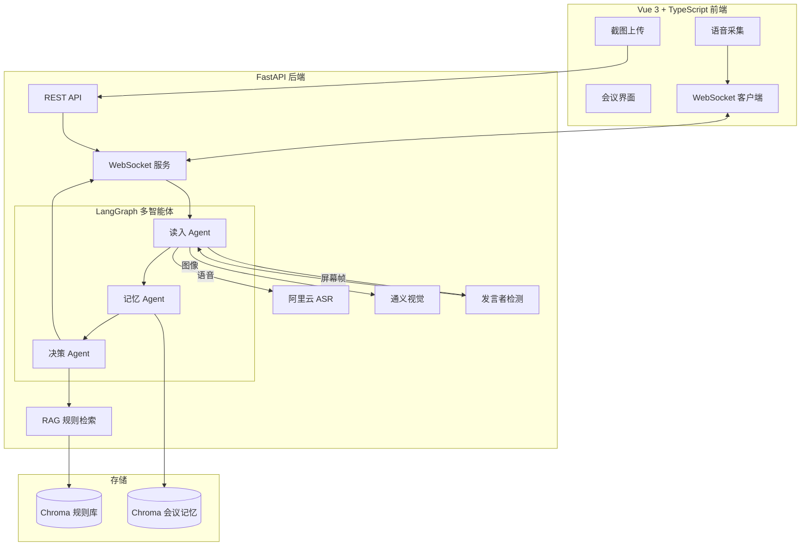

# 鹅鸭杀会议实时分析助手 - 架构与实现计划

## 一、现有基础与可复用组件


| 组件  | 现状                                                                                    | 复用方式                                                                                 |
| --- | ------------------------------------------------------------------------------------- | ------------------------------------------------------------------------------------ |
| RAG | [rag/rag_service.py](rag/rag_service.py) + [rag/vector_store.py](rag/vector_store.py) | 扩展为「鹅鸭杀规则检索」专用服务，知识库放入 `data/`                                                       |
| 向量库 | Chroma + 阿里百炼 Embedding                                                               | 保持，新增 `meeting_memory` 集合存储会议记忆                                                      |
| LLM | 阿里通义 qwen3-max                                                                        | 保持，各 Agent 共用或按需切换                                                                   |
| 配置  | YAML 驱动                                                                               | 扩展 [config/agent.yaml](config/agent.yaml)、[config/prompts.yaml](config/prompts.yaml) |


---

## 二、推荐整体架构




---

## 三、三智能体职责与数据流

### 1. 读入 Agent（Ingestion Agent）

- **职责**：接收多模态输入，转为结构化文本；基于语气语调做情绪描述；发言者与语音匹配
- **输入**：语音流（WebSocket）、会议截图（HTTP 上传）、屏幕帧（双路模式，用于发言者匹配）
- **能力**：
  - 语音：阿里云 DashScope 实时 ASR（Fun-ASR），WebSocket 流式转写
  - 图像：通义 Qwen-VL 解析会议截图（角色、发言顺序、投票界面等）
  - 情绪：LLM 对转写文本做情绪推断，粒度可调（per_sentence / per_segment / per_time_window / disabled）
  - 发言者匹配：屏幕帧缓冲 + OpenCV 模板匹配或 Qwen-VL，与 ASR 结果时间对齐，输出 `speaker_id`
- **输出**：`{ type: "speech"|"image", content: str, metadata: { speaker_id?, emotion_summary?, ... } }` 推送给记忆 Agent
- **开发期**：本地播放视频模拟时，用 PyAudioWPatch 捕获系统音频；双路采集脚本（音频+屏幕）支持发言者匹配联调

### 2. 记忆 Agent（Memory Agent）

- **职责**：简化发言、提取情绪、持久化会议状态
- **输入**：读入 Agent 的结构化内容
- **能力**：
  - 发言简化：LLM 提炼关键信息（谁说了什么、立场、证据）
  - 情绪总结：识别紧张、怀疑、指控等
  - 存储：写入 Chroma `meeting_memory` 集合，支持按时间/角色检索
- **输出**：更新后的会议摘要 + 情绪标签，传递给决策 Agent

### 3. 决策 Agent（Decision Agent）

- **职责**：结合 RAG 规则与会议记忆，给出发言与投票建议
- **输入**：记忆 Agent 的摘要、当前会议阶段、用户角色（若已知）
- **能力**：
  - 调用 RAG 检索鹅鸭杀规则、玩法、角色技能
  - 生成建议：如何发言、如何投票、如何应对质疑
- **输出**：结构化建议（文本 + 可选 JSON），通过 WebSocket 推回前端

---

## 四、技术选型与依赖


| 层级     | 技术                            | 说明                               |
| ------ | ----------------------------- | -------------------------------- |
| 多智能体编排 | **LangGraph**                 | 与现有 LangChain 兼容，支持有状态图、条件边、人机协作 |
| 后端框架   | **FastAPI**                   | 异步、WebSocket 原生支持、自动 OpenAPI     |
| 前端     | **Vue 3 + TypeScript + Vite** | 组件化、类型安全                         |
| 实时通信   | **WebSocket**                 | 语音流、分析结果双向推送                     |
| 语音识别   | **阿里云 DashScope ASR**         | 与现有百炼账号统一，WebSocket 实时转写         |
| 图像理解   | **通义 Qwen-VL**                | 会议截图解析，可升级 Qwen-Omni             |
| 发言者检测  | **OpenCV 模板匹配 / Qwen-VL**     | 视觉发言标识 + 时间对齐，匹配发言者与语音           |
| RAG 扩展 | 现有 Chroma + Embedding         | 新增规则知识库，复用 `RagSummarizeService` |


---

## 五、目录结构建议

```
GooseGooseDuck-Agent/
├── backend/                    # FastAPI 后端
│   ├── main.py                 # 入口、路由、WebSocket
│   ├── api/
│   │   ├── meeting.py          # 会议相关 REST
│   │   └── upload.py           # 截图上传
│   ├── agents/
│   │   ├── graph.py            # LangGraph 编排
│   │   ├── ingestion.py        # 读入 Agent
│   │   ├── memory.py           # 记忆 Agent
│   │   └── decision.py         # 决策 Agent
│   ├── services/
│   │   ├── asr_service.py      # 阿里云 ASR 封装
│   │   ├── vision_service.py   # 通义视觉封装
│   │   ├── speaker_detection_service.py  # OpenCV/Vision 发言者检测
│   │   └── rag_rules.py        # 鹅鸭杀规则 RAG（复用 rag/）
│   └── schemas/                # Pydantic 模型
├── frontend/                   # Vue 3 前端
│   ├── src/
│   │   ├── views/Meeting.vue   # 会议主界面
│   │   ├── components/         # 语音、截图、建议展示
│   │   └── composables/        # WebSocket、录音
│   └── ...
├── rag/                        # 现有 RAG（扩展）
├── model/                      # 现有模型工厂
├── config/
│   ├── agent.yaml              # 各 Agent 配置
│   └── prompts.yaml            # 各 Agent prompt 路径
├── data/                       # 鹅鸭杀规则文档（txt/pdf）
├── scripts/                    # 开发期采集脚本
│   ├── audio_capture_dev.py    # PyAudioWPatch 捕获系统音频
│   └── dual_capture_dev.py     # 音频+屏幕双路采集（发言者匹配）
├── assets/templates/           # OpenCV 发言标识模板（从游戏截取）
└── requirements.txt
```

---

## 六、核心实现要点

### 6.1 LangGraph 编排示例

```python
# 伪代码：agents/graph.py
from langgraph.graph import StateGraph, END

def build_meeting_graph():
    workflow = StateGraph(MeetingState)
    workflow.add_node("ingestion", ingestion_agent)
    workflow.add_node("memory", memory_agent)
    workflow.add_node("decision", decision_agent)
    workflow.add_edge("ingestion", "memory")
    workflow.add_edge("memory", "decision")
    workflow.add_edge("decision", END)
    workflow.set_entry_point("ingestion")
    return workflow.compile()
```

### 6.2 RAG 规则知识库

- 在 `data/` 放入鹅鸭杀规则、角色说明、玩法文档（txt/pdf）
- 复用 [rag/vector_store.py](rag/vector_store.py) 的 `load_document()`，可新建 `goose_duck_rules` 集合
- 决策 Agent 查询时调用 `RagSummarizeService.rag_summarize()` 或封装专用 `rag_rules.query_rules(question)`

### 6.3 实时语音流程

1. 前端：`MediaRecorder` 采集麦克风 → 按帧发送 WebSocket；或开发期用 `scripts/audio_capture_dev.py` 捕获系统音频（本地播放视频模拟）
2. 后端：WebSocket 接收音频 → 转发至阿里云 ASR WebSocket 或 SDK
3. ASR 返回转写文本 → 读入 Agent 做情绪推断、发言者匹配（若有屏幕帧）→ 后续记忆、决策链路

### 6.4 会议截图流程

1. 前端：上传截图（Base64 或 FormData）
2. 后端：接收后调用 Qwen-VL 多模态 API，提取会议画面信息
3. 结果作为读入 Agent 的 `type: "image"` 输入

---

## 七、实施步骤建议

1. **修复既有问题**：chroma 键名、prompts 配置、file_handler 拼写与逻辑
2. **准备 RAG 知识库**：收集鹅鸭杀规则文档，配置 `data/` 与 chroma 集合
3. **搭建 FastAPI 骨架**：main、路由、WebSocket 占位
4. **实现读入 Agent**（详见 [读入 Agent 实现计划](.cursor/plans/读入_agent_实现计划_121eb861.plan.md)）：ASR、Vision、情绪推断、发言者检测、开发期双路采集脚本
5. **实现记忆 Agent**：简化发言、情绪总结、Chroma 存储
6. **实现决策 Agent**：RAG 规则检索、发言与投票建议
7. **LangGraph 编排**：三 Agent 串联
8. **搭建 Vue 前端**：会议界面、录音、截图上传、WebSocket 连接
9. **端到端联调**：语音→分析→建议 全链路（含发言者匹配）

---

## 八、待确认事项

- **用户角色是否已知**：若前端可传入「当前玩家角色」（鹅/鸭/中立等），决策 Agent 可给出更精准建议
- **会议阶段识别**：是否需自动识别「讨论中 / 投票中 / 报告尸体」等阶段，以调整建议策略
- **部署方式**：单机开发 or Docker/云部署，影响 CORS、WebSocket 代理配置

---

## 九、读入 Agent 详细计划

读入 Agent 的完整实现细节（ASR、Vision、情绪推断、发言者匹配、开发期音频采集、情绪粒度可调等）见：[读入 Agent 实现计划](.cursor/plans/读入_agent_实现计划_121eb861.plan.md)

---

## 十、A/B 协作接口

A（读入 Agent）与 B（记忆+决策 Agent）的协作接口、数据格式、通讯方式见：[A/B 协作接口设计](.cursor/plans/AB协作接口设计_plan.md)

**要点**：

- **共享契约**：`backend/schemas/contract.py`，含 `IngestionOutput`（A→B）、`DecisionOutput`（B→前端）
- **通讯**：同进程推荐同步回调；可选异步队列或 HTTP
- **session_id**：由路由层统一生成，贯穿整场会议

