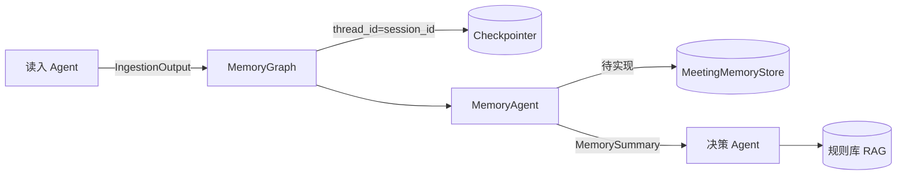
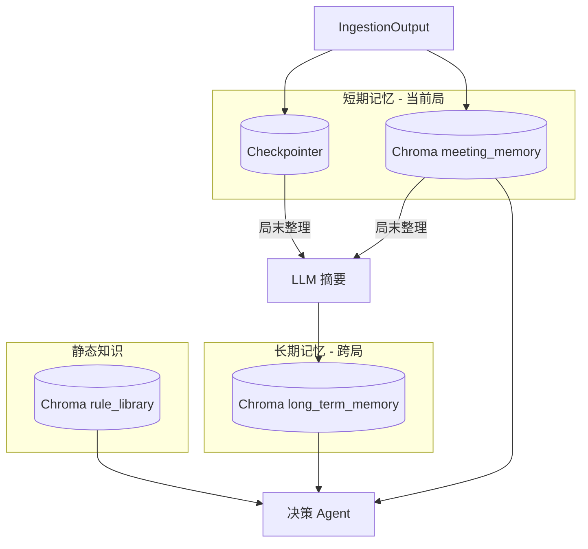
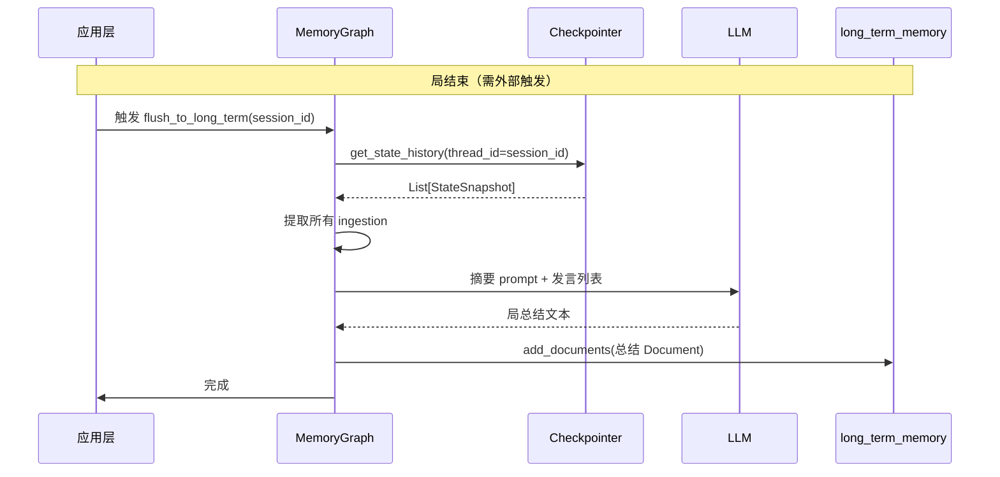

# 鹅鸭杀记忆 Agent 存储架构分析与方案推荐

## 一、现状梳理

### 1.1 已有组件


| 组件                     | 实现                                          | 用途                                                               |
| ---------------------- | ------------------------------------------- | ---------------------------------------------------------------- |
| **Checkpointer**       | `AsyncSqliteSaver` + `ShortMemoryStore`     | LangGraph 图状态持久化，`thread_id` = `session_id`                      |
| **MeetingMemoryStore** | Chroma `meeting_memory` 集合                  | 会议记忆向量存储（`add`/`get_recent`/`search` 待实现）                        |
| **规则库 RAG**            | Chroma `rule_library`                       | 鹅鸭杀规则、玩法等静态知识（[rag/vector_store.py](work_B/rag/vector_store.py)） |
| **MemoryAgent**        | `process(IngestionOutput) -> MemorySummary` | 消费单条输入，返回摘要（当前为占位实现）                                             |


### 1.2 数据流




### 1.3 Checkpointer 存储内容

LangGraph Checkpointer 按 `thread_id` 保存**图状态历史**。每次 `ainvoke` 会追加一个 checkpoint，可通过 `graph.get_state_history(config)` 获取：

- 每个 checkpoint 的 `state.values` 包含：`ingestion`（本次输入的 `IngestionOutput`）、`summary`（本次输出的 `MemorySummary`）
- 当前 `MemoryTestState` 为单条结构，不累积列表，因此**历史中每个 checkpoint 对应一次发言**

---

## 二、问题一：长短期记忆应存储什么？

### 2.1 三种存储的职责边界


| 存储          | 时间范围     | 典型用途             | 更新频率   |
| ----------- | -------- | ---------------- | ------ |
| **短期记忆**    | 当前局/当前会议 | 实时决策、当前轮发言上下文    | 每句发言更新 |
| **长期记忆**    | 跨局/跨会话   | 玩家习惯、历史对局模式、跨局推理 | 每局结束更新 |
| **RAG 规则库** | 永久       | 规则、角色技能、玩法       | 几乎不变   |


### 2.2 方案对比

#### 方案 A：短期=本轮发言（每人一条 IngestionOutput），长期=各轮总结，RAG=规则


| 存储  | 内容                             | 优点            | 缺点            |
| --- | ------------------------------ | ------------- | ------------- |
| 短期  | 当前局每条 `IngestionOutput`（发言/图像） | 粒度细，支持按人、按序检索 | 单局数据量大时检索成本高  |
| 长期  | 每局 LLM 生成的总结（关键事件、投票、身份揭示等）    | 跨局检索轻量，语义清晰   | 需在局末做摘要，有信息损失 |
| RAG | 规则文档                           | 与会议数据隔离，职责清晰  | -             |


**适用**：需要跨局分析（如「3号上次当鸭子时投票很晚」）、长期记忆需语义检索。

---

#### 方案 B：短期=整局发言，长期=RAG（会议历史也进向量库）


| 存储  | 内容                     | 优点                            | 缺点                            |
| --- | ---------------------- | ----------------------------- | ----------------------------- |
| 短期  | 整局所有发言的原始/轻处理版本        | 实现简单，Checkpointer 或 Chroma 即可 | 长期与规则混在同一 RAG 中，语义混杂          |
| 长期  | 与规则一起放入同一 Chroma 做 RAG | 无需单独长期存储                      | 规则与会议历史混合，检索易受干扰；规则应优先、会议应可过期 |


**不推荐**：规则与会议历史语义不同，混在一起会降低检索质量。

---

#### 方案 C：短期=整局发言，长期=各轮总结，RAG=规则（三层分离）


| 存储  | 内容                              | 优点                  | 缺点               |
| --- | ------------------------------- | ------------------- | ---------------- |
| 短期  | 当前局全部 `IngestionOutput`         | 与方案 A 类似，但强调「整局」为边界 | 需明确「局」的起止        |
| 长期  | 每局总结，单独集合（如 `long_term_memory`） | 规则、短期、长期三者完全分离      | 需维护第三个 Chroma 集合 |
| RAG | 规则                              | 职责单一                | -                |


**适用**：与方案 A 本质相同，只是把长期记忆单独成集合，便于按需扩展（如 TTL、归档）。

---

#### 方案 D：短期=Checkpointer 状态，长期=Chroma 语义检索


| 存储  | 内容                               | 优点          | 缺点                                               |
| --- | -------------------------------- | ----------- | ------------------------------------------------ |
| 短期  | 仅用 Checkpointer 存图状态，不单独写 Chroma | 实现最简单，无重复存储 | Checkpointer 非向量库，无法语义检索；`get_state_history` 需遍历 |
| 长期  | Chroma 存各局总结，支持语义检索              | 长期可做 RAG    | 短期无法做「相似发言」检索                                    |


**适用**：若短期只需「最近 N 条」拼接、不需要语义检索，可考虑。

---

### 2.3 推荐结论

**推荐采用方案 A / C（等价，C 更清晰）**：

1. **短期记忆**：当前局每条 `IngestionOutput`
  - 存储位置：Checkpointer（图状态）+ 可选 Chroma `meeting_memory`（若需语义检索）  
  - 粒度：每人每句一条记录，`metadata` 含 `speaker_id`、`emotion_summary`、`sequence_id`  
  - 边界：以 `session_id`（= 一局游戏）为隔离
2. **长期记忆**：各局总结
  - 存储位置：Chroma 新集合 `long_term_memory`（与 `meeting_memory`、`rule_library` 分离）  
  - 内容：每局结束由 LLM 生成的摘要（关键指控、投票结果、身份揭示、情绪走向等）  
  - 用途：跨局检索，如「3号当鸭子时的发言风格」
3. **RAG 规则库**：保持现有 `rule_library`
  - 仅存规则、角色、玩法等静态知识  
  - 与会议数据完全分离

### 2.4 架构示意




---

## 三、问题二：如何将 Checkpointer 管理的短期记忆整理到长期记忆？

### 3.1 数据来源

短期记忆可能存在于两处：

1. **Checkpointer**：`graph.get_state_history(config)` 可拿到该 `thread_id` 下所有 checkpoint，每个 `state.values` 含 `ingestion`、`summary`
2. **Chroma meeting_memory**：若已实现 `add`，可按 `session_id` 过滤取出当前局全部 Document

**建议**：以 **Checkpointer 为主**，因为它是当前实际在用的存储；若后续在 Chroma 也存了原始发言，可任选其一或合并去重。

### 3.2 整理流程




### 3.3 实现要点

#### 3.3.1 局结束触发

需要明确「一局结束」的信号，可选：

- **显式 API**：前端/路由在游戏结束时调用 `POST /memory/flush?session_id=xxx`
- **特殊 IngestionOutput**：读入 Agent 发送 `type="game_end"` 等标记
- **超时**：若 N 分钟无新发言，自动触发（需额外定时任务）

**推荐**：显式 API，由业务层在确定局结束时调用，逻辑清晰。

#### 3.3.2 从 Checkpointer 提取数据

```python
# 伪代码
config = {"configurable": {"thread_id": session_id}}
history = list(graph.get_state_history(config))
ingestions = []
for snap in history:
    ing = snap.values.get("ingestion")  # 或 "ingestions" 若改为列表
    if ing is not None:
        ingestions.append(ing)
# 按 sequence_id 排序
ingestions.sort(key=lambda x: x.sequence_id or 0)
```

注意：若 `MemoryTestState` 中 `ingestion` 为单条，则每个 checkpoint 对应一次 `ainvoke`，历史中会包含该次输入。

#### 3.3.3 摘要生成

将 `ingestions` 拼接成文本，送入 LLM，生成结构化摘要，例如：

- 本局关键指控与反驳
- 投票结果与出局者
- 身份揭示（若已知）
- 情绪/发言风格简要描述

摘要格式建议为可检索的文本（如 Markdown 或键值对），便于存入 Chroma 做向量检索。

#### 3.3.4 写入长期记忆

将摘要转为 `Document`，`metadata` 含 `session_id`、`game_end_time`、`player_count` 等，写入 `long_term_memory` 集合。

#### 3.3.5 短期记忆清理（可选）

- **Checkpointer**：LangGraph 的 checkpoint 通常保留，可作为审计日志；若需节省空间，可调用 saver 的删除接口（若支持）或定期归档
- **Chroma meeting_memory**：可按 `session_id` 删除该局 Document，或保留做「近期会议」检索，视需求而定

### 3.4 与现有代码的衔接

- 在 [MemoryGraph](work_B/backend/agents/my_graph.py) 或新建 `MemoryService` 中增加 `flush_to_long_term(session_id: str)` 方法
- 该方法内部：获取 `graph` 实例、调用 `get_state_history`、提取 `ingestion`、调用 LLM、写入 `long_term_memory`
- 需传入编译后的 `graph` 及 `config`，以便访问 checkpointer；若 graph 在请求间复用，需保证 `thread_id` 与 `session_id` 一致

---

## 四、配置与实现清单

### 4.1 配置补充

当前 [config/chroma.yaml](work_B/config/chroma.yaml) 仅有 `rule_library`，需增加 `meeting_memory` 和 `long_term_memory`，例如：

```yaml
rule_library: { ... }  # 现有

meeting_memory:
  collection_name: meeting_memory
  persist_directory: data/chroma_meeting
  k: 10
  chunk_size: 500
  chunk_overlap: 50
  separators: ["\n\n", "\n", "。", "！", "？", " ", ""]

long_term_memory:
  collection_name: long_term_memory
  persist_directory: data/chroma_long_term
  k: 5
  chunk_size: 800
  chunk_overlap: 80
  separators: ["\n\n", "\n", "。", "！", "？", " ", ""]
```

并确保 [config_handler](work_B/utils/config_handler.py) 能正确解析嵌套键（当前 `meeting_memory_service` 已使用 `chroma_conf['meeting_memory']`，需确认 chroma.yaml 实际结构）。

### 4.2 实现清单（供后续开发参考）


| 步骤  | 内容                                                                           |
| --- | ---------------------------------------------------------------------------- |
| 1   | 在 chroma.yaml 中补充 `meeting_memory`、`long_term_memory` 配置                     |
| 2   | 实现 `MeetingMemoryStore.add`、`get_recent`、`search`，按 `session_id` 过滤          |
| 3   | 新建 `LongTermMemoryStore`，封装 `long_term_memory` 集合的 add/search                |
| 4   | 在 MemoryAgent 或 MemoryGraph 中实现 `flush_to_long_term(session_id)`             |
| 5   | 设计局摘要 LLM prompt，将 `ingestions` 转为结构化摘要                                      |
| 6   | 提供显式 API（如 `POST /memory/flush`）供业务层在局结束时调用                                  |
| 7   | 决策 Agent 检索时：规则用 `rule_library`，当前局用 `meeting_memory`，跨局用 `long_term_memory` |


---

## 五、总结


| 问题          | 推荐方案                                                                                            |
| ----------- | ----------------------------------------------------------------------------------------------- |
| **短期存什么**   | 当前局每条 `IngestionOutput`（每人每句一条），存于 Checkpointer + 可选 Chroma `meeting_memory`                    |
| **长期存什么**   | 每局 LLM 生成的总结，存于 Chroma `long_term_memory`                                                       |
| **RAG 存什么** | 仅规则、角色、玩法等静态知识，保持 `rule_library` 独立                                                             |
| **如何整理**    | 局结束时触发 `flush_to_long_term`，从 `get_state_history` 提取所有 `ingestion`，LLM 摘要后写入 `long_term_memory` |


