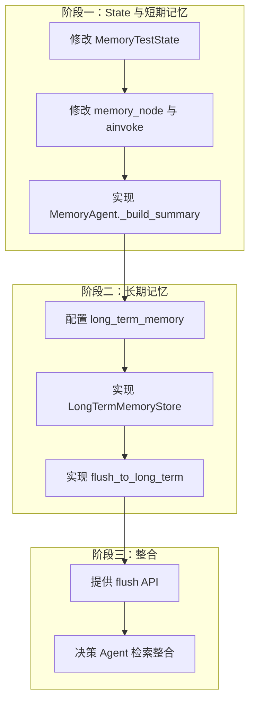

# 鹅鸭杀记忆 Agent 实现步骤（推荐方案）

基于「短期=Checkpointer 累积 ingestions，长期=Chroma 摘要，RAG=规则库」的推荐方案，本文档给出详细实施步骤与提示。

---

## 一、整体流程概览



---

## 二、阶段一：State 与短期记忆

### 步骤 1：修改 MemoryTestState 支持累积 ingestions

**文件**：`work_B/backend/schemas/contract.py`

**目标**：将单条 `ingestion` 改为可累积的 `ingestions` 列表。

**提示**：

1. **LangGraph 的 reducer**：LangGraph 使用 `Annotated[Type, reducer]` 实现状态累积。`operator.add` 对 list 会做拼接：`[a] + [b] = [a, b]`。

2. **TypedDict 与 Pydantic**：
   - 若当前 `MemoryTestState` 继承 `BaseModel`，需查阅 LangGraph 文档确认 Pydantic 是否支持 `Annotated` reducer。
   - 若不支持，可改用 `TypedDict` 定义 state（LangGraph 原生支持）：
     ```python
     from typing import TypedDict, Annotated
     import operator
     
     class MemoryTestState(TypedDict, total=False):
         ingestions: Annotated[list[dict], operator.add]  # 存 IngestionOutput 的 dict 形式
         summary: Optional[dict]  # MemorySummary 的 dict 形式
     ```
   - 若保持 Pydantic，可尝试：
     ```python
     ingestions: Annotated[list[IngestionOutput], operator.add] = Field(default_factory=list)
     ```

3. **JsonPlusSerializer 兼容**：`ALLOWED_MSGPACK_MODULES` 已包含 `IngestionOutput`、`MemorySummary`，若 `ingestions` 为 `list[IngestionOutput]`，序列化应无问题。若改用 TypedDict 存 dict，需确保 dict 可被 JSON 序列化。

4. **字段变更**：
   - 删除或弃用 `ingestion: IngestionOutput`
   - 新增 `ingestions: Annotated[list[IngestionOutput], operator.add]`（或等价形式）
   - `summary` 可保留，存最新一次 `MemorySummary`

---

### 步骤 2：修改 memory_node 与 ainvoke

**文件**：`work_B/backend/agents/my_graph.py`

**目标**：让每次调用追加一条 ingestion，并从 state 中读取已有 ingestions 用于构建摘要。

**提示**：

1. **ainvoke 入参**：入口仍接收单条 `IngestionOutput`，但传入 state 时应以列表形式，以便 reducer 追加：
   ```python
   # 调用时传入
   return await self.graph.ainvoke({"ingestions": [ingestion]}, config)
   ```

2. **memory_node 入参**：state 中 `ingestions` 已包含历史 + 本次新增（reducer 在节点执行前合并）。因此：
   - 本次的 `ingestion` = `state["ingestions"][-1]` 或从入参 `{"ingestions": [x]}` 得知是 `x`
   - 构建摘要时使用 `state["ingestions"]` 全量列表

3. **memory_node 返回值**：应返回 `{"ingestions": [本次 ingestion]}` 以触发 reducer 追加。注意：若 ainvoke 已传入 `ingestions: [ingestion]`，START 到 memory_agent 的边会先合并，memory_node 收到的 state 已包含本次 ingestion。此时 memory_node 只需返回 `{"summary": summary}`，**无需再返回 ingestions**（否则会重复）。请根据 LangGraph 的「边传递」与「reducer 执行时机」确认实际行为。

4. **建议验证方式**：写单测，连续 ainvoke 3 次不同 ingestion，然后 `graph.get_state(config)`，检查 `values["ingestions"]` 长度是否为 3。

---

### 步骤 3：实现 MemoryAgent._build_summary

**文件**：`work_B/backend/agents/memory_agent.py`

**目标**：根据 `ingestions` 列表生成 `MemorySummary`，供决策 Agent 使用。

**提示**：

1. **入参**：`_build_summary` 应接收 `ingestions: list[IngestionOutput]`，而非仅 `session_id`。`recent_n` 可保留，用于只取最近 N 条。

2. **summary_text**：拼接最近 N 条，格式如：
   ```
   [speaker_id] content (emotion_summary)
   ```
   按 `sequence_id` 或 `timestamp` 排序后再拼接。

3. **recent_items**：最近 5–10 条的简化结构，如 `{"speaker_id": str, "content": str, "type": str, "timestamp": str}`。

4. **emotion_tags**：从各条 `metadata` 的 `emotion_summary` 提取关键词，去重后组成列表。

5. **数据来源**：`ingestions` 由调用方传入。在 `memory_node` 中，调用 `agent.process(state["ingestions"])` 时，需传入完整 `ingestions`。

6. **process 接口**：可改为 `process(ingestions: list[IngestionOutput]) -> MemorySummary`，或保留 `process(ingestion: IngestionOutput)` 但内部调用 `_build_summary` 时由外部传入完整列表。推荐后者：`memory_node` 从 state 取 `ingestions`，调用 `agent._build_summary(ingestions)` 或 `agent.process(ingestions)`。

---

## 三、阶段二：长期记忆

### 步骤 4：配置 long_term_memory

**文件**：`work_B/config/chroma.yaml`

**目标**：新增 `long_term_memory` 集合配置，与 `rule_library`、`meeting_memory` 并列。

**提示**：

1. **当前结构**：chroma.yaml 仅含 `rule_library`。`meeting_memory_service` 使用 `chroma_conf['meeting_memory']`，需确认 chroma.yaml 中是否已有 `meeting_memory` 配置；若无，需一并补充。

2. **long_term_memory 建议配置**：
   ```yaml
   long_term_memory:
     collection_name: long_term_memory
     persist_directory: data/chroma_long_term
     k: 5
     chunk_size: 800
     chunk_overlap: 80
     separators: ["\n\n", "\n", "。", "！", "？", " ", ""]
   ```

3. **config_handler**：`load_chroma_config()` 返回完整 dict，`chroma_conf['long_term_memory']` 即可访问。无需修改 config_handler 逻辑。

---

### 步骤 5：实现 LongTermMemoryStore

**文件**：`work_B/backend/services/meeting_memory_service.py`（或新建 `long_term_memory_service.py`）

**目标**：封装 Chroma `long_term_memory` 集合的 add 与 search。

**提示**：

1. **初始化**：类似 `MeetingMemoryStore`，使用 `chroma_conf['long_term_memory']` 的 `collection_name`、`persist_directory`。

2. **add 方法**：接收 `Document` 或 `(summary_text: str, metadata: dict)`，转为 Document 后 `add_documents`。metadata 建议含：`session_id`、`game_end_time`、`player_count` 等。

3. **search 方法**：`search(query: str, k: int = 5) -> list[Document]`，用于跨局语义检索。若需按时间过滤，可加 `where` 条件（Chroma 支持 metadata 过滤）。

4. **无需 get_recent**：长期记忆为摘要，按语义检索即可，无需按时间取最近 N 条（除非有特殊需求）。

---

### 步骤 6：实现 flush_to_long_term

**文件**：`work_B/backend/agents/my_graph.py` 或新建 `work_B/backend/services/memory_flush_service.py`

**目标**：局结束时，从 Checkpointer 取最新 ingestions，调用 LLM 生成摘要，写入 long_term_memory。

**提示**：

1. **触发时机**：由业务层在「局结束」时调用，例如 `POST /memory/flush?session_id=xxx` 或显式调用 `flush_to_long_term(session_id)`。

2. **获取 ingestions**：
   ```python
   config = {"configurable": {"thread_id": session_id}}
   state = graph.get_state(config)
   ingestions = state.values.get("ingestions", [])
   ```
   若 state 中为 dict 列表，需转回 `IngestionOutput`（如 `IngestionOutput.model_validate(x)`）。

3. **排序**：按 `sequence_id` 或 `timestamp` 排序，保证时间顺序。

4. **LLM 摘要**：
   - 将 ingestions 拼接成文本，格式如：`[speaker_id] content (emotion_summary)`
   - 设计 prompt，要求输出：关键指控、投票结果、身份揭示、情绪走向等
   - 输出格式建议为可检索的文本（如 Markdown 或键值对），便于向量化

5. **写入**：将摘要转为 `Document`，`page_content` 为摘要文本，`metadata` 含 `session_id`、`game_end_time` 等，调用 `LongTermMemoryStore.add`。

6. **依赖**：需持有 `graph` 实例和 `config`。若 MemoryGraph 在请求间复用，需保证 `thread_id` 与 `session_id` 一致。可考虑在 `MemoryGraph` 或 `MemoryGraph` 的工厂中增加 `flush_to_long_term(session_id: str)` 方法，内部访问 `self.graph`。

7. **短期记忆清理**：可选。Checkpointer 默认保留历史；若需节省空间，可查阅 AsyncSqliteSaver 是否提供按 thread 删除接口。Chroma meeting_memory 若未使用，可暂不实现清理。

---

## 四、阶段三：整合

### 步骤 7：提供 flush API

**文件**：路由层（如 `work_B/backend/api/` 或 `main.py`）

**目标**：暴露 `POST /memory/flush` 或类似接口，供前端/业务在局结束时调用。

**提示**：

1. **请求体**：`{"session_id": str}` 或 query 参数 `?session_id=xxx`。

2. **调用链**：路由 → `flush_to_long_term(session_id)` → 返回成功或失败。

3. **错误处理**：session_id 不存在、无 ingestions、LLM 失败等，需返回明确错误信息。

---

### 步骤 8：决策 Agent 检索整合

**文件**：决策 Agent 所在模块

**目标**：决策时结合规则 RAG、短期记忆（当前局）、长期记忆（跨局）。

**提示**：

1. **规则**：`rule_library` 检索，用于规则、角色、玩法。

2. **当前局**：从 `MemorySummary` 获取（由 MemoryAgent 的 `_build_summary` 生成），或从 `graph.get_state(config).values["ingestions"]` 取最近 N 条拼接。无需再查 Chroma meeting_memory（除非后续增加局内语义检索）。

3. **跨局**：`LongTermMemoryStore.search(query)`，根据当前问题做语义检索，取最近 N 局相关摘要。

4. **Prompt 拼接**：将规则片段、当前局摘要、跨局摘要按顺序拼入决策 Agent 的 prompt。

---

## 五、检查清单

| 步骤 | 内容 | 验证方式 |
|------|------|----------|
| 1 | MemoryTestState 支持 ingestions 累积 | 单测：连续 ainvoke 后 get_state，ingestions 长度正确 |
| 2 | memory_node 与 ainvoke 正确传递 | 单测：多轮调用后 summary 包含最近发言 |
| 3 | _build_summary 基于 ingestions 生成 | 人工检查 summary_text、recent_items 格式 |
| 4 | chroma.yaml 含 long_term_memory | 启动不报 KeyError |
| 5 | LongTermMemoryStore add/search | 单测：add 后 search 能召回 |
| 6 | flush_to_long_term 流程 | 单测：mock 局结束，验证 long_term 中有新 Document |
| 7 | flush API | 接口测试 |
| 8 | 决策 Agent 整合 | 端到端测试 |

---

## 六、注意事项

1. **TypedDict 与 Pydantic**：若 Pydantic state 不支持 reducer，需改用 TypedDict。此时 node 内 `state` 为 dict，需用 `state["ingestions"]` 访问，注意类型转换。

2. **JsonPlusSerializer**：`ALLOWED_MSGPACK_MODULES` 已包含 `IngestionOutput`、`MemorySummary`。若 `ingestions` 为 `list[IngestionOutput]`，序列化应正常；若为 `list[dict]`，需确保 dict 可 JSON 序列化。

3. **session_id 与 thread_id**：务必保持一致，否则 Checkpointer 与 flush 无法对应同一局。

4. **meeting_memory 可选**：当前方案以 Checkpointer 为主，可暂不实现 `MeetingMemoryStore` 的 add/get_recent/search。若后续需要局内语义检索，再补充。

---

## 七、参考文件路径

| 用途 | 路径 |
|------|------|
| State 定义 | `work_B/backend/schemas/contract.py` |
| 图与节点 | `work_B/backend/agents/my_graph.py` |
| MemoryAgent | `work_B/backend/agents/memory_agent.py` |
| 短期存储 | `work_B/backend/services/meeting_memory_service.py` |
| 配置 | `work_B/config/chroma.yaml` 或 `config/short_memory.yaml` |
