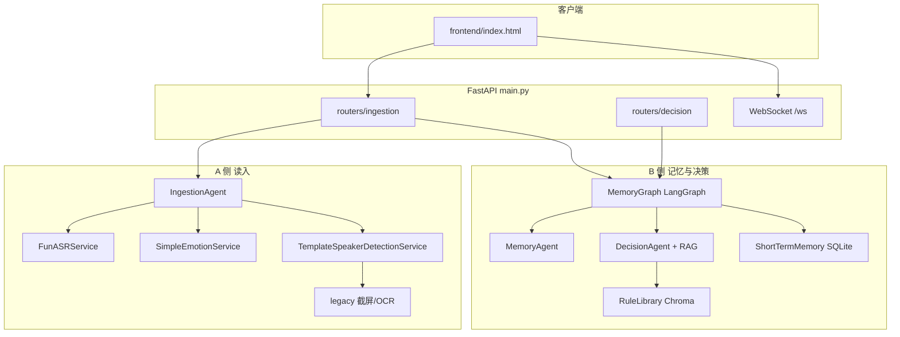

# GooseGooseDuck-Agent

鹅鸭杀会议实时分析助手：在 **单进程 FastAPI** 中整合 **A 侧读入（截屏/麦克风/ASR）** 与 **B 侧记忆与决策（LangGraph + RAG）**，浏览器通过 `frontend/index.html` 与 WebSocket/API 交互。

## 架构概览



- **数据流**：A 侧产出结构化 `IngestionOutput`，经路由推入 `MemoryGraph`；图内先更新短期记忆摘要，再调用决策与规则库检索。
- **配置**：`config/` 在仓库根目录，由 `backend/utils/path_tool.py` 解析为绝对路径（与运行时工作目录无关）。

## 主要技术栈

| 层次 | 技术 |
| --- | --- |
| API / 实时 | FastAPI、Uvicorn、WebSocket |
| A 侧 | Windows 截屏（pywin32）、OpenCV、PyAudio、FunASR（ModelScope）、RapidOCR + ONNX Runtime |
| B 侧 LLM | LangChain（通义 ChatTongyi / DashScopeEmbeddings，需 `DASHSCOPE_API_KEY`） |
| 编排与持久化 | LangGraph、AsyncSqliteSaver（检查点）、aiosqlite、短期记忆 SQLite |
| RAG | Chroma、规则库（PDF/XLSX/文本 入库） |

## 使用前提

1. 使用 **Anaconda** 中的 **`ggd`** 环境（与 `requirements.txt` 版本对齐）：

   ```bash
   conda activate ggd
   ```

2. 申请阿里云百炼 API Key，设置环境变量 **`DASHSCOPE_API_KEY`**。

3. 在已激活的 `ggd` 环境中安装依赖（仓库根目录）：

   ```bash
   pip install -r requirements.txt
   ```

## 启动

在仓库根目录、`ggd` 已激活的前提下：

**PowerShell**

```powershell
conda activate ggd
$env:PYTHONPATH = "."
python main.py
```

**cmd**

```cmd
conda activate ggd
set PYTHONPATH=.
python main.py
```

默认监听 `http://127.0.0.1:9888`。浏览器访问 `/` 即加载 `frontend/index.html`。

等价方式：

```bash
conda activate ggd
set PYTHONPATH=.
uvicorn main:app --host 127.0.0.1 --port 9888
```

入口为仓库根目录的 **`main.py`**（`PYTHONPATH` 需包含仓库根以便 `import backend`）。

## API 说明（节选）

- `GET /` — 前端页面
- `GET /api/status` — A 侧监控状态
- `WebSocket /ws` — 实时事件
- `GET /api/v1/status`、`POST /api/v1/ingestion`、`POST /api/v1/decision` — B 侧记忆与决策

## 配置

- `config/ingestion.yaml` — 读入相关参数
- `config/agent.yaml`、`config/prompts.yaml` — Agent 与提示词路径
- `config/rag.yaml`、`config/chroma.yaml` — 模型名与向量库
- `config/short_memory.yaml` — 短期记忆

## 仓库文件结构（用途说明）

```
GooseGooseDuck-Agent/
├── main.py                      # FastAPI 应用入口：生命周期内初始化 MemoryGraph、SQLite、OCR 预热线程
├── requirements.txt             # Python 依赖（与 conda ggd 中 pip 版本对齐）
├── README.md
├── config/                      # 全局 YAML：ingestion、agent、RAG、Chroma、短期记忆等
├── data/                        # 运行时数据：规则库原文、Chroma 持久化、short_memory.db 等
├── frontend/
│   └── index.html               # 单页前端：监控、WebSocket、ingestion/decision 调用
├── backend/
│   ├── app_state.py             # 进程级状态：事件循环、LangGraph、aiosqlite 连接
│   ├── agents/
│   │   ├── ingestion.py         # A 侧编排：ASR、情绪启发式、发言人模板检测
│   │   ├── memory_agent.py      # 会议摘要 / 短期记忆更新
│   │   ├── decision_agent.py    # 决策 + RAG 总结链
│   │   └── my_graph.py          # LangGraph 状态机定义
│   ├── routers/
│   │   ├── ingestion.py         # A 侧 HTTP/WebSocket、静态首页、转发至 MemoryGraph
│   │   └── decision.py          # B 侧决策 API
│   ├── services/
│   │   ├── asr_service.py       # FunASR 封装
│   │   ├── emotion_service.py   # 基于关键词的简易情绪标签
│   │   ├── speaker_detection_service.py  # 与截屏 ROI 结合的发言人检测
│   │   ├── meeting_memory_service.py     # 短期记忆存储与 Chroma 摘要
│   │   └── rag/
│   │       ├── rule_library.py  # 规则库加载与 Chroma 检索
│   │       └── rag_service.py   # RAG 问答链
│   ├── model/
│   │   └── factory.py           # ChatTongyi、DashScopeEmbeddings 工厂
│   ├── schemas/                 # Pydantic：ingestion 契约、决策、图状态
│   ├── utils/                   # 路径、配置、日志、提示词加载、文件哈希等
│   ├── prompts/                 # 各 Agent 提示词模板（txt）
│   └── legacy/                  # 窗口选择、截屏、发言人数字 OCR/模板、麦克风+ASR 管线（历史实现）
├── template_imgs/               # 发言人模板图等资源（供 legacy 检测）
├── test/                        # 脚本与示例数据（如会议文本）
├── Docs/                        # 功能说明与设计笔记（中文）
├── logs/                        # 运行日志（若配置写入）
├── legacy/                      # 与 backend/legacy 类似的旧版副本（若存在，以 backend 为准）
├── utils/、model/、prompts/     # 历史根目录副本（若存在，以 backend 下为准）
└── ggd/                         # 子工程/实验目录（与主入口独立）
```

## 许可证与说明

业务逻辑与模型调用依赖云端 API 与本机音视频权限；请在合规前提下使用。
